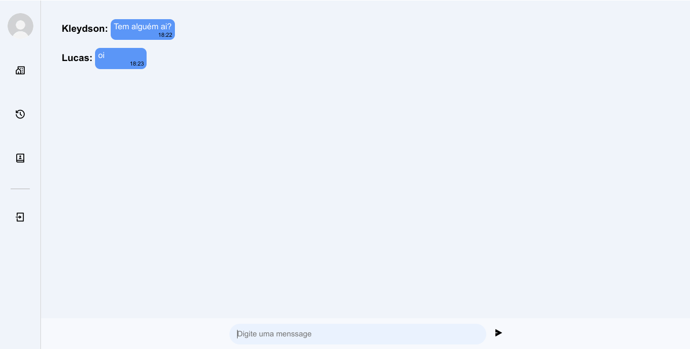

# Projeto de Chat Aovivo com WebSocket

 

## Seja Bem-vindos 👋

Olá! Eu sou um projeto de chat ao vivo, desenvolvido para facilitar a comunicação e a interação entre as pessoas em tempo real. Comigo, você pode conversar com outras pessoas de todo o mundo, compartilhar suas ideias, trocar experiências e aprender novas coisas.

Com uma interface intuitiva e fácil de usar, você pode enviar mensagens de texto para outros usuários.

Estou sempre evoluindo e me adaptando às necessidades dos meus usuários, oferecendo novos recursos e funcionalidades para tornar a sua experiência de chat ao vivo cada vez mais agradável e produtiva.

Então, se você quer se conectar com outras pessoas, ampliar sua rede de contatos e compartilhar suas ideias, eu sou o projeto de chat ao vivo ideal para você! Venha experimentar e descubra todas as possibilidades que posso oferecer.

## Funcionalidades

- Conversas por meio de mensagens.
- Encontrar amizades.

## Tecnologias Utilizada

- Html5
- Css3
- JavaScript
- WebSocket
- Socket.io
- Node.js

## Como utilizar 

1. Clona o repositório
2. Abre o vscode na pasta do projeto
3. Abre um terminal integrado no vscode, clicando com o botão direito do mouse
4. Roda o comando "node server.js"

## Veja o Projeto Online
Deploy Do Projeto
- [Acessar](https://Kleydsonpessanha.github.io/PupilsChat/)  

**Divirta-se!** 🚀
